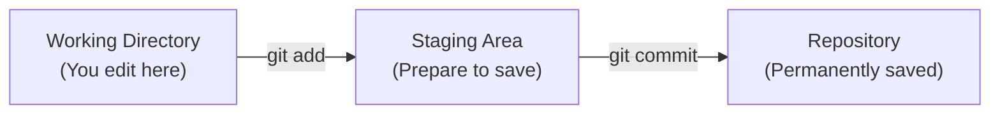
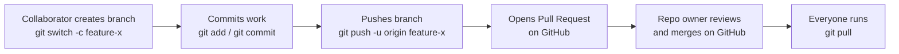

# Git Crash Course

A hands-on introduction to Git for software engineers about to work together on a React project.

**Total Duration:** ~2 hours

**Prerequisites:**

- VS Code installed
- Git installed on your computer

---

## Section 1: Getting Started with Git (15 minutes)

### 1.1 Introduction

Git is a version control system that helps you track changes in your files. Think of it as a "save game" feature for your code - you can always go back to previous versions if something goes wrong.

**Why Git for Software Engineers?**

- Track changes in components, functions, and styles
- Experiment with new UI ideas without losing your working code
- Collaborate with your team on a shared React codebase
- Keep a history of how a feature was built

### 1.2 Initializing a Repository

**What we'll do:** Turn a regular folder into a Git-tracked folder

**Steps:**

1. **Create a new folder** called `git-demo` (use File Explorer/Finder or VS Code)

2. **Open the folder in VS Code**
   - File → Open Folder → Select `git-demo`

3. **Open the Terminal in VS Code**
   - Terminal → New Terminal (or press `` Ctrl+` ``)

4. **Check if this is a Git repository:**

   ```bash
   git status
   ```

   You'll see an error message: `fatal: not a git repository`
   - This confirms the folder is NOT yet tracked by Git
   - It's just a regular folder right now

5. **Initialize Git:**
   ```bash
   git init
   ```

**What just happened?**

- Git created a hidden `.git` folder that stores all your version history
- Your folder is now a **Git repository**
- Git is ready to track changes

6. **Check the status again:**

   ```bash
   git status
   ```

   Now you should see: "On branch main" and "No commits yet"
   - The error is gone! Git is now tracking this folder

**Exercise:** Follow the steps above to create and initialize your Git repository.

---

## Section 2: The Git Workflow - From Changes to History (20 minutes)

### 2.1 Understanding the Three Stages

When you work with Git, your files go through three stages:



### 2.2 Hands-On: Your First Commit

**Step 1: Create a file in VS Code**

1. Click "New File" in VS Code
2. Name it: `note1.txt`
3. Type inside: `This is my first note about the React project`
4. Save the file (Ctrl+S or Cmd+S)

**Step 2: Check Git status**

In the Terminal:

```bash
git status
```

You'll see `note1.txt` in red under "Untracked files"

- **Red** = Git sees the file but isn't tracking it yet

**Step 3: Add to Staging Area**

```bash
git add note1.txt
```

Check status again:

```bash
git status
```

Now `note1.txt` is in green under "Changes to be committed"

- **Green** = Ready to be saved permanently

**Step 4: Commit to Repository**

```bash
git commit -m "Add first note about the React project"
```

Check status:

```bash
git status
```

Should say: "nothing to commit, working tree clean"

- Your change is now permanently saved in Git history!

### 2.3 Working with Multiple Files

Let's practice the workflow with more files. We'll write a couple of small JavaScript functions - no need to actually run anything, we're just practicing Git.

1. **Create 3 new files in VS Code:**
   - `formatCurrency.js` → Type:
     ```js
     function formatCurrency(amount) {
       return `$${amount.toFixed(2)}`;
     }
     ```
   - `calculateSalary.js` → Type:
     ```js
     function calculateSalary(hoursWorked, hourlyRate) {
       return hoursWorked * hourlyRate;
     }
     ```
   - `README.txt` → Type: `My JavaScript Helper Functions`

2. **Check what Git sees:**

   ```bash
   git status
   ```

   All three files should be red (untracked)

3. **Add all files at once:**

   ```bash
   git add .
   ```

   The dot (`.`) means "add everything in this folder"

4. **Commit them:**
   ```bash
   git commit -m "Add currency and salary helper functions"
   ```

### 2.4 Viewing Your History

See all your commits:

```bash
git log
```

Too much information? Try this simpler view:

```bash
git log --oneline
```

Each line shows:

- A unique ID (like `a3f5c2b`)
- Your commit message

**Exercise:** Create 3-4 files (a mix of `.js` functions and `.txt` notes) and commit them using the workflow above.

---

## Section 3: Understanding .gitignore (10 minutes)

### 3.1 Why .gitignore?

Now that you know how to add and commit files, there's an important exception to learn: some files shouldn't be tracked by Git at all.

- **Installed dependencies** (`node_modules`) - huge, and reinstallable from `package.json`
- **Passwords and API keys** - security risk!
- **Build output and logs** - generated automatically, not source code

### 3.2 Creating .gitignore

**Steps:**

1. **In VS Code:** Click "New File" button or right-click in Explorer
2. **Name it:** `.gitignore` (don't forget the dot at the beginning!)
3. **Add these patterns:**

```gitignore
# Installed packages - reinstall with npm install
node_modules/

# Build output
dist/
build/

# Logs
*.log
npm-debug.log*

# Passwords and keys - NEVER commit these!
.env
.env.local
credentials.json
*.key

# Your IDE settings
.vscode/
.DS_Store
```

4. **Save the file** (Ctrl+S or Cmd+S)

**What this does:**

- Git will now ignore any file matching these patterns
- You won't accidentally commit thousands of dependency files or passwords

**Why `node_modules/` matters so much:** In a real React project, `node_modules` can contain tens of thousands of files. Committing it would make your repository huge and slow, and it's easily recreated by anyone who runs `npm install`.

### 3.3 Committing Your .gitignore

You already know the workflow from Section 2 - `.gitignore` is just another file to add and commit:

```bash
git add .gitignore
git commit -m "Add .gitignore"
```

**Why commit it on its own?**

- It keeps this commit focused on one clear purpose, rather than mixing housekeeping in with real code changes
- In most real projects, `.gitignore` is committed early, often before much other code exists
- Once it's committed, Git will ignore `node_modules/` and `.env` from this point forward - try creating a `node_modules` folder with a file inside it, then run `git status` to confirm Git ignores it

**Exercise:** Create a `.gitignore` file in your repository with the patterns above, then commit it on its own using what you learned in Section 2.

---

## Section 4: Understanding Commits (10 minutes)

### 4.1 What is a Commit?

A **commit** is like taking a snapshot of your project at a specific moment. Each commit remembers:

- What files changed
- Who made the changes
- When it happened
- Why (your commit message)

### 4.2 Writing Good Commit Messages

**Bad commit messages:** ❌

```bash
git commit -m "updates"
git commit -m "fix"
git commit -m "asdf"
```

**Good commit messages:** ✅

```bash
git commit -m "Add input validation to formatCurrency"
git commit -m "Fix rounding bug in calculateSalary"
git commit -m "Update README with function descriptions"
```

**Tips for good messages:**

- Be specific about what changed
- Use present tense: "Add" not "Added"
- Keep it short but descriptive
- Imagine you're reading this 6 months from now

**Exercise:** Look at your commit history (`git log --oneline`). Are your messages clear?

---

## Section 5: Undoing Changes with Git Reset (15 minutes)

### 5.1 Why We Need to Undo

Common situations:

- "Oops, I committed the wrong file!"
- "I want to change my commit message"
- "I need to start over on this change"

### 5.2 Three Ways to Reset

All three reset examples below use `HEAD~1`.

**What does `HEAD~1` mean?**

- `HEAD` means "the commit you are currently on"
- `~1` means "go back 1 commit from there"
- So `HEAD~1` means "the commit before the current one"

You can change the number to go further back:

```bash
git reset HEAD~2    # Go back 2 commits
git reset HEAD~3    # Go back 3 commits
```

The reset type (`--soft`, mixed/default, or `--hard`) controls what happens to your files after Git moves back.

#### Option 1: Soft Reset (Keep Your Changes Ready)

Goes back one commit but keeps your files ready to commit again

```bash
git reset --soft HEAD~1
```

**Where is the file after reset?** ✅ **Staging Area** (ready to commit again)

- Your changes are still there
- They're still in green when you run `git status`
- Just need to run `git commit` again

**When to use:** You want to edit the commit message or add more files

#### Option 2: Mixed Reset (Keep Your Changes, But Unstage)

Goes back one commit, keeps your changed files but unstages them

```bash
git reset HEAD~1
```

**Where is the file after reset?** ✅ **Working Directory** (not staged)

- Your changes are still there
- They're in red when you run `git status`
- You need to run `git add` and then `git commit` again

**When to use:** You want to reorganize which files go into which commit

**💡 This is the most commonly used reset!** It's the default (you don't need `--mixed` flag) because it lets you:
- Review and edit your changes before recommitting
- Split one commit into multiple smaller commits
- Add more changes before committing again

#### Option 3: Hard Reset (⚠️ Delete Everything)

Goes back one commit and **deletes all your changes**

```bash
git reset --hard HEAD~1
```

**Where is the file after reset?** ❌ **Gone!** (deleted completely)

- Your changes are DELETED
- The file goes back to its previous committed state
- You CANNOT get your changes back

**When to use:** You want to completely abandon your recent work
**WARNING:** You'll lose your changes permanently!

### 5.3 Practice Undoing

Let's practice with mixed reset (the most common reset type):

1. **Create and commit a file:**
   - Create `work.txt` in VS Code
   - Type: `Draft of my formatCurrency function`
   - Save it
   - Add and commit:
     ```bash
     git add work.txt
     git commit -m "Add formatCurrency draft"
     ```

2. **Undo with mixed reset:**
   ```bash
   git reset HEAD~1
   ```
   
   **Why mixed reset?** It gives you the most flexibility - your changes are safe but unstaged, so you can review, edit, or reorganize them before committing again.

3. **Check status:**

   ```bash
   git status
   ```

   Your file is still there but unstaged (red)!
   - **The file is in the Working Directory** - you can edit it before staging again

4. **Edit the file in VS Code:**
   - Change text to: `Complete formatCurrency function with tests`
   - Save it

5. **Add and commit again with better message:**
   ```bash
   git add work.txt
   git commit -m "Add complete formatCurrency function with tests"
   ```

**Exercise:** Practice each type of reset to understand the differences.

**Optional Exercise:** Try resetting more than one commit back.

1. Create and commit two small files:

   ```bash
   echo "First draft" > draft1.txt
   git add draft1.txt
   git commit -m "Add first draft"

   echo "Second draft" > draft2.txt
   git add draft2.txt
   git commit -m "Add second draft"
   ```

2. Check your recent history:

   ```bash
   git log --oneline
   ```

3. Reset back two commits with mixed reset:

   ```bash
   git reset HEAD~2
   ```

4. Check status:

   ```bash
   git status
   ```

   Both files should still be in your working directory, but they are no longer staged or committed.

---

## Section 6: Git Branching (20 minutes)

### 6.1 What are Branches?

Imagine you're writing a book:

- **Main branch** = Your published chapters (working version)
- **Feature branch** = A draft where you experiment with new ideas

Branches let you work on new features without breaking your working code.

**Common use for software engineers:**

- Main branch = Working version of the app
- Feature branch = Building a new component or function

### 6.2 Creating Your First Branch

**See your current branch:**

```bash
git branch
```

You should see: `* main` (the asterisk shows where you are)

**Create a new branch:**

```bash
git branch feature-new-functions
```

**Switch to the new branch:**

```bash
git switch feature-new-functions
```

Or do both in one command:

```bash
git switch -c feature-new-functions
```

**Verify you switched:**

```bash
git branch
```

Now the asterisk should be on `feature-new-functions`

### 6.3 Working on Your Branch

Let's create something on our feature branch:

1. **Create a new file in VS Code:**
   - Create `applyDiscount.js`
   - Type:
     ```js
     function applyDiscount(price, percentOff) {
       return price - (price * percentOff) / 100;
     }
     ```
   - Save it

2. **Commit on the feature branch:**

   ```bash
   git add applyDiscount.js
   git commit -m "Add applyDiscount function"
   ```

3. **Switch back to main:**

   ```bash
   git switch main
   ```

4. **Look at your files in VS Code:**
   - `applyDiscount.js` disappeared! 😱
   - Don't worry, it's safe on the other branch

5. **Switch back to feature branch:**

   ```bash
   git switch feature-new-functions
   ```

   - `applyDiscount.js` is back! 😊

**What's happening?**

- Each branch has its own version of your files
- Git swaps the files when you switch branches
- Changes on one branch don't affect the other

### 6.4 Visualizing Branches

See your branches with history:

```bash
git log --oneline --graph --all
```

This shows a visual tree of your commits and branches!

**Exercise:** Create a feature branch, add 2-3 text files with JavaScript functions or notes, commit them, then switch between main and feature branches to see the files appear and disappear.

---

## Section 7: Merging Branches (20 minutes)

### 7.1 Why Merge?

Once your feature is complete and tested, you want to bring it back into the main branch.

**Merging = Combining the changes from two branches**

### 7.2 Simple Merge (Fast-Forward)

This happens when main hasn't changed since you created the feature branch.

**Let's do it:**

1. **Make sure you're on the feature branch:**

   ```bash
   git switch feature-new-functions
   ```

2. **Add another file:**
   - Create `capitalize.js` in VS Code
   - Type:
     ```js
     function capitalize(word) {
       return word.charAt(0).toUpperCase() + word.slice(1);
     }
     ```
   - Save and commit:
     ```bash
     git add capitalize.js
     git commit -m "Add capitalize function"
     ```

3. **Switch to main:**

   ```bash
   git switch main
   ```

4. **Merge the feature branch into main:**

   ```bash
   git merge feature-new-functions
   ```

5. **Check your files:**
   - All the files from feature branch are now in main!
   - Check the log:
     ```bash
     git log --oneline
     ```

**What happened?**

- Git "fast-forwarded" main to include all feature branch commits
- No conflicts because main hadn't changed

### 7.3 Merge with Merge Commit

This happens when both branches have new commits - they've diverged.

**Let's set this up:**

1. **Create and switch to a new branch:**

   ```bash
   git switch -c feature-validation
   ```

2. **On feature branch, create a file:**
   - Create `notes.txt`
   - Type: `Notes on input validation`
   - Commit:
     ```bash
     git add notes.txt
     git commit -m "Add validation notes"
     ```

3. **Switch back to main:**

   ```bash
   git switch main
   ```

4. **On main, create a different file:**
   - Create `main_note.txt`
   - Type: `Important note on main branch`
   - Commit:
     ```bash
     git add main_note.txt
     git commit -m "Add important note on main"
     ```

   **Now both branches have diverged!** Main has `main_note.txt` and feature-validation has `notes.txt`

5. **Merge the feature branch into main:**

   ```bash
   git merge feature-validation
   ```

   **What happens next:**
   - A text editor will open asking you to write a merge commit message
   - It will have a default message like `Merge branch 'feature-validation'`
   - You can keep the default or edit it
   - **In VS Code:** Just save the file (Ctrl+S or Cmd+S) and close the tab
   - **In a terminal editor (Vim):** Press `Esc`, type `:wq`, press Enter
   
   **On success, you'll see:**
   ```
   Merge made by the 'ort' strategy.
   ```
   
   **What is 'ort' strategy?** It's Git's default merge algorithm (since Git 2.34). "Ort" stands for "Ostensibly Recursive's Twin" - it's a faster, more efficient version of Git's recursive merge strategy. For most users, you don't need to worry about it - it just means Git successfully combined your branches automatically!

6. **Look at the log:**

   ```bash
   git log --oneline --graph
   ```

   You'll see a **merge commit** that joins the two branches!

**Exercise:** Practice both types of merges.

### 7.4 Cleaning Up Merged Branches

Once you've merged a feature branch back into main, the branch has served its purpose. It's good practice to delete it to keep your branch list clean and manageable.

**Why delete merged branches?**

- Keeps `git branch` output clean and readable
- Prevents confusion about which branches are active
- The commits are already in main - nothing is lost!

**Check which branches you have:**

```bash
git branch
```

You might see something like:

```
  feature-new-functions
  feature-validation
* main
```

**Delete a merged branch (safe):**

```bash
git branch -d feature-new-functions
```

- The `-d` flag means "delete"
- Git will **prevent you** from deleting if the branch isn't fully merged (safe!)
- You'll see: `Deleted branch feature-new-functions`

**What if Git refuses to delete?**

If you see an error like:

```
error: The branch 'feature-xyz' is not fully merged.
```

This means:

- The branch has commits that aren't in main yet
- Git is protecting you from losing work
- **Options:**
  - Merge the branch first, then delete it
  - Or use force delete (next section) if you're sure

**Force delete a branch (use carefully!):**

```bash
git branch -D feature-practice
```

- The `-D` flag (capital D) means "force delete"
- Use this when you want to delete a branch with unmerged work
- **Warning:** You'll lose any commits that aren't in main!
- Only use this if you're certain you don't need those changes

**Important reassurance:**

When you delete a branch after merging:

- All the commits are **still in main's history**
- Your work is **not lost**
- You're just removing the branch label/pointer
- The branch name is gone, but the code lives on in main

**Quick practice:**

1. **List your branches:**

   ```bash
   git branch
   ```

2. **Delete a branch you've already merged:**

   ```bash
   git branch -d feature-validation
   ```

3. **Verify it's gone:**

   ```bash
   git branch
   ```

4. **Check that the commits are still in main:**
   ```bash
   git log --oneline
   ```
   You'll see all the commits from the deleted branch!

**When to keep a branch:**

- You're still working on it
- You plan to continue development later
- It's not ready to merge yet

**When to delete a branch:**

- It's been successfully merged
- You don't need to work on it anymore
- You want to start fresh with a new branch for the next feature

**Exercise:** Practice the complete workflow: Create a branch → Make commits → Merge to main → Delete the branch → Verify commits are still in history.

---

## Section 8: Handling Merge Conflicts (25 minutes)

### 8.1 What is a Merge Conflict?

A conflict happens when:

- The **same lines** in the **same file** are changed differently in two branches
- Git doesn't know which version to keep

**Example:**

- Main branch changes line 1 to "Version A"
- Feature branch changes line 1 to "Version B"
- Git says: "You decide which one to keep!"

### 8.2 Creating a Conflict (On Purpose)

Let's intentionally create a conflict to learn how to fix it. We'll use a small `calculatePayout` function - the kind of shared helper your group React project might have several people editing.

**Step 1: Create the initial file on main**

1. Make sure you're on main:

   ```bash
   git switch main
   ```

2. Create `calculatePayout.js` in VS Code:

   ```js
   function calculatePayout(hoursWorked, hourlyRate) {
     return hoursWorked * hourlyRate;
   }
   ```

3. Save and commit:
   ```bash
   git add calculatePayout.js
   git commit -m "Add initial calculatePayout function"
   ```

**Step 2: Create a feature branch and change the file**

1. Create and switch to feature branch:

   ```bash
   git switch -c feature-overtime
   ```

2. Edit `calculatePayout.js` in VS Code - change it to:

   ```js
   function calculatePayout(hoursWorked, hourlyRate) {
     const overtimeHours = Math.max(0, hoursWorked - 40);
     const regularHours = hoursWorked - overtimeHours;
     return regularHours * hourlyRate + overtimeHours * hourlyRate * 1.5;
   }
   ```

3. Save and commit:
   ```bash
   git add calculatePayout.js
   git commit -m "Add overtime pay to calculatePayout"
   ```

**Step 3: Go back to main and make a DIFFERENT change**

1. Switch to main:

   ```bash
   git switch main
   ```

2. Edit `calculatePayout.js` in VS Code - change it to:

   ```js
   function calculatePayout(hoursWorked, hourlyRate) {
     if (hoursWorked < 0 || hourlyRate < 0) {
       throw new Error("Values must be positive");
     }
     return hoursWorked * hourlyRate;
   }
   ```

3. Save and commit:
   ```bash
   git add calculatePayout.js
   git commit -m "Add input validation to calculatePayout"
   ```

**Step 4: Try to merge - CONFLICT!**

```bash
git merge feature-overtime
```

You'll see:

```
Auto-merging calculatePayout.js
CONFLICT (content): Merge conflict in calculatePayout.js
Automatic merge failed; fix conflicts and then commit the result.
```

Don't panic! This is normal. 😊

### 8.3 Understanding the Conflict

**Look at `calculatePayout.js` in VS Code.** You'll see something like:

```js
function calculatePayout(hoursWorked, hourlyRate) {
<<<<<<< HEAD
  if (hoursWorked < 0 || hourlyRate < 0) {
    throw new Error("Values must be positive");
  }
  return hoursWorked * hourlyRate;
=======
  const overtimeHours = Math.max(0, hoursWorked - 40);
  const regularHours = hoursWorked - overtimeHours;
  return regularHours * hourlyRate + overtimeHours * hourlyRate * 1.5;
>>>>>>> feature-overtime
}
```

**What do these markers mean?**

- `<<<<<<< HEAD` = Start of YOUR version (current branch - main)
- `=======` = Separator
- `>>>>>>> feature-overtime` = End of THEIR version (merging branch)

Git is asking: **"Which version do you want to keep?"**

Notice that both changes are actually useful here - this is a common real-world situation where you want to combine ideas from both branches rather than pick just one.

### 8.4 Resolving the Conflict

**Option 1: Manually decide what to keep**

Edit `calculatePayout.js` in VS Code to combine both changes. For example:

```js
function calculatePayout(hoursWorked, hourlyRate) {
  if (hoursWorked < 0 || hourlyRate < 0) {
    throw new Error("Values must be positive");
  }
  const overtimeHours = Math.max(0, hoursWorked - 40);
  const regularHours = hoursWorked - overtimeHours;
  return regularHours * hourlyRate + overtimeHours * hourlyRate * 1.5;
}
```

**Important:** Delete all the conflict markers (`<<<<<<<`, `=======`, `>>>>>>>`)

**Option 2: Use VS Code's conflict resolver**

VS Code shows buttons above the conflict:

- **Accept Current Change** - Keep main branch version
- **Accept Incoming Change** - Keep feature branch version
- **Accept Both Changes** - Keep both (one after another)
- **Compare Changes** - See side-by-side comparison

Click the button you want! (For this example, you'd still want to manually combine the logic afterward, since "both" pasted one after another wouldn't quite make sense in one function.)

**After resolving:**

1. Save the file

2. Check status:

   ```bash
   git status
   ```

3. Add the resolved file:

   ```bash
   git add calculatePayout.js
   ```

4. Complete the merge:

   ```bash
   git commit -m "Merge feature-overtime and resolve conflicts"
   ```
   
   **Important:** This creates a **merge commit** regardless of how you resolved the conflict (manually or with VS Code buttons). The merge commit exists because the two branches diverged, not because of the conflict itself.

5. Check the log:
   ```bash
   git log --oneline --graph
   ```

### 8.5 If You Want to Cancel the Merge

If you decide "I don't want to merge anymore":

```bash
git merge --abort
```

This cancels the merge and goes back to before you tried to merge.

**Exercise:** Create your own conflict scenario with a different function. Practice resolving it using both manual editing and VS Code's buttons.

---

## Section 9: Keeping Your Feature Branch Updated (15 minutes)

### 9.1 The Problem

Imagine this scenario:

- You create a feature branch on Monday
- You work on your feature for a week
- Meanwhile, your teammates add 20 commits to main
- When you try to merge your feature back... BIG CONFLICTS! 😱

This is especially common in a group React project, where multiple people are editing shared components and helper functions at the same time.

**Solution:** Regularly update your feature branch with main's changes

### 9.2 Method 1: Merge Main into Your Feature (Recommended for Beginners)

This is the safer approach:

1. **Switch to your feature branch:**

   ```bash
   git switch feature-overtime
   ```

2. **Merge main into your feature:**

   ```bash
   git merge main
   ```

3. **Resolve any conflicts** (like we learned in Section 8)

4. **Continue working on your feature**

**Why this works:**

- Your feature branch now has all the latest changes from main
- When you eventually merge feature back to main, there will be fewer conflicts
- You test that your feature works with the latest main code

**When to do this:**

- Daily, if main changes frequently
- Before you finish your feature
- Before creating a pull request (in team settings)

### 9.3 Method 2: Rebase (Brief Mention)

There's another way called "rebase" that makes a cleaner history:

```bash
git switch feature-branch
git rebase main
```

**What's different:**

- Rebase "replays" your commits on top of main
- Creates a linear history (looks cleaner)
- More advanced - can be confusing for beginners

**For now:** Stick with the merge method above. You can learn rebase later!

### 9.4 Practice Scenario

Let's simulate keeping a feature branch updated:

1. **Create a feature branch:**

   ```bash
   git switch main
   git switch -c feature-practice
   ```

2. **Add a file on feature:**
   - Create `feature_work.txt`
   - Type: `Working on my feature`
   - Commit it

3. **Switch to main and add something:**

   ```bash
   git switch main
   ```

   - Create `main_update.txt`
   - Type: `Important main update`
   - Commit it

4. **Update your feature with main's changes:**

   ```bash
   git switch feature-practice
   git merge main
   ```

5. **Check your files:**
   - You should now have both `feature_work.txt` AND `main_update.txt`!

**Exercise:** Practice this flow several times with different files.

---

## Section 10: (Optional) Pushing to GitHub (15 minutes)

### 10.1 Why Use GitHub?

So far, we've been working with **local Git** - everything is on your computer.

**GitHub** adds cloud storage and collaboration:

- ☁️ **Backup** - Your code is safe even if your computer breaks
- 👥 **Collaboration** - Share code with teammates
- 📱 **Access anywhere** - Work from any computer
- 🔍 **Portfolio** - Show your work to potential employers

**Think of it as:**

- **Local Git** = Saving your game on your console
- **GitHub** = Cloud save that syncs across devices

### 10.2 Creating a Repository on GitHub

**Prerequisites:** You need a GitHub account (free at github.com)

**Steps:**

1. **Go to GitHub.com** and log in

2. **Click the "+" icon** in the top right → "New repository"

3. **Fill in the details:**
   - Repository name: `git-demo`
   - Description: `Learning Git for our React project`
   - Choose: **Public** or **Private**
   - **Do NOT** check "Initialize with README" (we already have commits locally)

4. **Click "Create repository"**

5. **You'll see a page with instructions** - we'll use VS Code to push our code!

### 10.3 Pushing to GitHub - VS Code Method (Easiest!)

**VS Code makes pushing to GitHub incredibly simple:**

**First time setup:**

1. **Sign in to GitHub in VS Code** (if not already)
   - Click the account icon in bottom left
   - "Sign in to sync settings" → Sign in with GitHub

2. **Open Source Control** (left sidebar, or Ctrl/Cmd+Shift+G)

3. **Click "Publish Branch"** button
   - VS Code will prompt you to select the repository name
   - Choose whether to make it public or private
   - That's it! Your code is now on GitHub! 🎉

**What VS Code does automatically:**
- Creates the remote connection to GitHub
- Pushes all your commits
- Handles authentication
- Sets up tracking for future pushes

**For subsequent pushes:**
- Make your changes and commit them (Source Control panel)
- Click the **"Sync Changes"** button (or the ↑ arrow with a number)
- Done!

**Advantages:**
- No need to remember commands
- Visual interface
- Automatic authentication
- Clear indicators of what will be pushed

### 10.4 Pushing to GitHub - Command Line Method (Alternative)

**If you prefer the command line, here's how:**

**In your VS Code terminal:**

1. **Add GitHub as a "remote"** (a remote is a cloud copy):

   ```bash
   git remote add origin https://github.com/YOUR-USERNAME/git-demo.git
   ```

   Replace `YOUR-USERNAME` with your actual GitHub username!

2. **Verify the remote was added:**

   ```bash
   git remote -v
   ```

   You should see:

   ```
   origin  https://github.com/YOUR-USERNAME/git-demo.git (fetch)
   origin  https://github.com/YOUR-USERNAME/git-demo.git (push)
   ```

**What is "origin"?**

- Just a nickname for your GitHub repository
- You could name it anything, but "origin" is the standard name

2. **Push your commits:**

**Push = Upload your commits to GitHub**

```bash
git push -u origin main
```

**What this does:**

- `push` - Upload commits
- `-u origin main` - Set GitHub's main branch as the default destination
- Next time, you can just type `git push`

**You might be asked to:**

- Enter your GitHub username
- Enter a password or Personal Access Token (GitHub no longer accepts passwords - you need to create a token in GitHub Settings → Developer settings → Personal access tokens)

**After pushing:** Refresh your GitHub repository page - your files are there! 🎉

### 10.5 The Daily Workflow with GitHub

Once connected, your workflow becomes:

**Start of the day:**

```bash
git pull
```

Downloads any changes from GitHub (useful when collaborating)

**During work:**

```bash
# Work on files
git add .
git commit -m "Your message"
```

**End of the day (or after each feature):**

```bash
git push
```

Uploads your commits to GitHub

**Or in VS Code:** Just click the "Sync Changes" button!

### 10.6 Cloning a Repository

**Clone = Download a repository from GitHub to your computer**

If you want to work on another computer:

```bash
git clone https://github.com/YOUR-USERNAME/git-demo.git
cd git-demo
```

Now you have a complete copy with all history!

**Or in VS Code:** Command Palette (Ctrl/Cmd+Shift+P) → "Git: Clone" → paste the URL

### 10.7 Quick Reference

```bash
# Setup (one time)
git remote add origin https://github.com/USER/REPO.git

# Check remotes
git remote -v

# Upload commits to GitHub
git push                    # After first push
git push -u origin main    # First time only

# Download updates from GitHub
git pull

# Download a repository
git clone https://github.com/USER/REPO.git
```

**VS Code shortcuts:**
- Publish Branch: First time pushing a new branch
- Sync Changes: Push and pull in one action
- Command Palette → "Git: Clone": Clone a repository

### 10.8 Common Issues

**Problem:** `git push` asks for password repeatedly

**Solutions:**

- Use SSH keys (more advanced)
- Use GitHub Desktop app (easier for beginners)
- Use VS Code's built-in Git features (easiest!)

**Problem:** Can't push because someone else made changes

**Solution:**

```bash
git pull              # Download their changes
# Fix any conflicts if needed
git push              # Now push your changes
```

**Problem:** Forgot to pull before making changes

**Solution:**

```bash
git pull              # Might create merge conflicts
# Resolve conflicts
git commit
git push
```

**Note:** Most of these issues are avoided when using VS Code's UI, as it handles conflicts and syncing visually!

### 10.9 Next Steps with GitHub

You now know the basics of push and pull. Next, in Section 11, you'll put branches, GitHub, and code review together into the workflow real teams use: **feature branches with Pull Requests.**

Beyond that, there's more to explore later:

- **GitHub Actions** - Automate testing and deployment
- **Issues** - Track bugs and features
- **GitHub Pages** - Host documentation websites

**For your group React project specifically:**

- Share components and helper functions with your team
- Collaborate on features without stepping on each other's work
- Track bugs and feature requests with Issues

---

## Section 11: A Simple Feature Branch Workflow with Pull Requests (20 minutes)

### 11.1 Why Use This Workflow?

So far you've been merging branches directly on your own computer. On a real team project, you don't want everyone pushing straight to `main` - a teammate's untested change could break the app for everyone.

**The Pull Request (PR) workflow adds a review step:**

1. A collaborator creates a branch and builds a feature on it
2. They push the branch to GitHub and open a **Pull Request** - a request to merge their branch into main
3. The repo owner (or a teammate) reviews the code on GitHub
4. Once it looks good, the owner merges the PR
5. Everyone pulls the updated `main`

This is the same branching and merging you already know - GitHub just adds a review step in the middle, and moves the actual merge onto GitHub instead of your local machine.



### 11.2 Roles for This Exercise

Since this workflow involves two sides, pair up with a partner (or simulate both roles yourself):

- **Repo owner** - created the GitHub repository, has final say on what gets merged into `main`
- **Collaborator** - was added to the repo (or forked it) and wants to contribute a feature

**Prerequisite:** The repo owner has pushed the project to GitHub (Section 10) and added the collaborator to the repository (**Settings → Collaborators** on GitHub).

### 11.3 Collaborator: Create a Feature Branch and Push It

1. **Clone the repo (if you don't already have it locally):**

   ```bash
   git clone https://github.com/OWNER-USERNAME/git-demo.git
   cd git-demo
   ```

2. **Create a feature branch using your own name**, so it doesn't collide with your teammates' branches:

   ```bash
   git switch -c feature-your-name
   ```

   For example, if your name is Sam: `git switch -c feature-sam`

3. **Add a new file, also named after you:**
   - Create `your-name.txt` (for example, `sam.txt`)
   - Type: `This branch was created by Sam`
   - Save it

   **Why name the branch and file after yourself?** If several collaborators follow this exercise on the same repo at the same time, using your name keeps everyone's branch and file separate - no two people will accidentally create the same branch or overwrite the same file.

4. **Commit your work:**

   ```bash
   git add your-name.txt
   git commit -m "Add note from Sam"
   ```

5. **Push the branch to GitHub:**

   ```bash
   git push -u origin feature-your-name
   ```

   **What each part means:**

   - `push` - Upload commits to GitHub
   - `origin` - The nickname for your GitHub repository (same as in Section 10)
   - `feature-your-name` - The name of the branch to push - since it doesn't exist on GitHub yet, this creates it there
   - `-u` - Short for `--set-upstream`; it links your local branch to the new branch on GitHub, so future pushes/pulls on this branch can just be `git push` / `git pull` without repeating the branch name

   **Note:** Unlike `main`, this branch doesn't exist on GitHub yet, so this command both creates it there and links it to your local branch.

### 11.4 Collaborator: Open a Pull Request

1. **Go to the repository on GitHub.com**

2. GitHub usually shows a banner: *"feature-your-name had recent pushes"* with a **Compare & pull request** button
   - Click it
   - If you don't see the banner, go to the **Pull requests** tab → **New pull request** → choose your branch

3. **Fill in the PR:**
   - Title: `Add note from Sam`
   - Description: A sentence or two on what the change does and why
   - Base branch: `main` ← Compare branch: `feature-sam` (or your own `feature-your-name`)

4. **Click "Create pull request"**

**What a Pull Request actually is:** It's not a Git concept - it's a GitHub feature. It just points at two branches and lets people comment on the diff between them before that diff becomes part of `main`.

### 11.5 Repo Owner: Review the Pull Request

1. **Open the Pull Requests tab** on GitHub and click into the new PR

2. **Look at the "Files changed" tab** - this shows exactly what the collaborator added or changed

3. **Leave feedback (optional for this exercise):**
   - Click a line number to leave an inline comment
   - Or add a general comment at the bottom
   - If changes are needed, the collaborator can push more commits to the same branch - they'll automatically show up in the same PR

4. **When it looks good, click "Merge pull request"** → **"Confirm merge"**

**What just happened?**

- GitHub performed the same kind of merge you did locally in Section 7 - just on GitHub's servers instead of your machine
- `main` on GitHub now includes the collaborator's file (for example, `sam.txt`)
- Your local `main` does **not** have it yet - it only exists on GitHub until you pull

### 11.6 Everyone: Sync Up

**Both the owner and the collaborator should now update their local `main`:**

```bash
git switch main
git pull
```

**Check that the new file is there:**

```bash
git log --oneline
```

You should see the merge commit and the collaborator's file (for example, `sam.txt`) in your working directory.

**Clean up the merged branch** (optional, mirrors Section 7.4):

```bash
git branch -d feature-your-name
```

If you also pushed the branch to GitHub, you can delete it there too - GitHub usually offers a **"Delete branch"** button right after a PR is merged.

### 11.7 Why Teams Use This Workflow

- **Nothing reaches `main` without a second pair of eyes** - catches bugs and mistakes early
- **Clear history** - each PR documents *why* a change was made, not just *what* changed
- **Safe experimentation** - a half-finished feature lives on its own branch until it's ready
- **Discussion happens in context** - comments are attached to the exact lines they're about

**Exercise:** With a partner (or as a group), each person creates their own `feature-your-name` branch, adds their `your-name.txt` file, opens a PR, and reviews/merges each other's PR.

---

## Summary and Best Practices (5 minutes)

### 12.1 Quick Command Reference

```bash
# Setup
git init                        # Start tracking a folder
git status                      # Check current state

# Basic workflow
git add <file>                  # Stage a file
git add .                       # Stage all files
git commit -m "message"         # Save a snapshot
git log --oneline               # View history

# Undoing
git restore <file>              # Discard changes in file
git restore --staged <file>     # Unstage a file
git reset --soft HEAD~1         # Undo commit, keep changes staged
git reset HEAD~1                # Undo commit, keep changes unstaged
git reset --hard HEAD~1         # Undo commit, delete changes ⚠️

# Branching
git branch                      # List branches
git branch <name>               # Create branch
git switch <name>               # Switch to branch
git switch -c <name>            # Create and switch
git merge <branch>              # Merge branch into current
git merge --abort               # Cancel a merge

# Keeping feature updated
git switch feature-branch
git merge main                  # Bring main changes into feature
```

### 12.2 Best Practices for Software Engineers

1. **Commit often** - Small commits are easier to understand and undo
2. **Write clear messages** - Your future self (and your teammates) will thank you
3. **Use .gitignore** - Don't commit `node_modules/` or credentials
4. **Use branches** - Even for small experiments
5. **Keep main stable** - Only merge working, tested code
6. **Update feature branches regularly** - Merge main into feature daily, especially on a group project
7. **Review before committing** - Check `git status` and files changed

### 12.3 Common Mistakes to Avoid

❌ Committing `node_modules/`
✅ Use `.gitignore` - teammates can reinstall with `npm install`

❌ Committing passwords or API keys
✅ Put them in `.gitignore` and use environment variables (`.env`)

❌ Vague commit messages like "updates" or "fix"
✅ Be specific: "Fix rounding bug in calculateSalary"

❌ Working directly on main branch
✅ Create a feature branch for each task

❌ Letting your feature branch fall far behind main
✅ Merge main into your feature branch regularly

### 12.4 What's Next?

After mastering this workflow, you can learn:

- **Code review etiquette** - How to give and receive helpful PR feedback
- **GitHub Actions** - Automatically run tests on every PR before it can be merged
- **Branch protection rules** - Require reviews or passing tests before merging into `main`
- **Rebase workflows** - Keeping history clean on active team projects
- **Handling PR conflicts** - Resolving conflicts that show up on GitHub instead of locally
